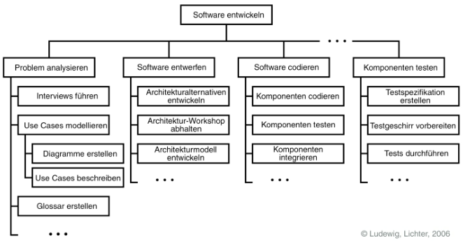

<h2>Table of Contents</h2>

<ul>
<li><a href="#sec-1">1. Relevante Themen</a>
<ul>
<li><a href="#sec-1-1">1.1. Qualitätssicherung</a>
<ul>
<li><a href="#sec-1-1-1">1.1.1. Aufgaben eines Qualitätsbeauftragten</a></li>
<li><a href="#sec-1-1-2">1.1.2. Kategorien der Qualitätssicherungsmaßnahmen</a></li>
<li><a href="#sec-1-1-3">1.1.3. Reviewsitzung</a></li>
<li><a href="#sec-1-1-4">1.1.4. Continuous Integration</a></li>
<li><a href="#sec-1-1-5">1.1.5. Tests</a></li>
</ul>
</li>
<li><a href="#sec-1-2">1.2. SCRUM-Überblicksmodell</a></li>
<li><a href="#sec-1-3">1.3. Projektplanung</a>
<ul>
<li><a href="#sec-1-3-1">1.3.1. Aufgaben des Projektleiters</a></li>
<li><a href="#sec-1-3-2">1.3.2. Aufgabenpakete - Eigenschaften</a></li>
<li><a href="#sec-1-3-3">1.3.3. Fertigstellungsgrad</a></li>
<li><a href="#sec-1-3-4">1.3.4. Meilensteine</a></li>
<li><a href="#sec-1-3-5">1.3.5. Schätzverfahren (Aufwandsschätzung)</a></li>
<li><a href="#sec-1-3-6">1.3.6. Projektphasen - Aufgaben dabei (Projektleiter) - Non-Agile-Mode</a></li>
<li><a href="#sec-1-3-7">1.3.7. Meeting</a></li>
</ul>
</li>
<li><a href="#sec-1-4">1.4. Softwareattribute?</a></li>
<li><a href="#sec-1-5">1.5. Versionsverwaltung</a>
<ul>
<li><a href="#sec-1-5-1">1.5.1. Version und Variante?</a></li>
</ul>
</li>
<li><a href="#sec-1-6">1.6. McCabe-Metrik?(zyklomatische Komplexität?)</a></li>
<li><a href="#sec-1-7">1.7. Meldeklassen im Change-Management</a></li>
<li><a href="#sec-1-8">1.8. Risikomanagement</a>
<ul>
<li><a href="#sec-1-8-1">1.8.1. Häufige Risiken</a></li>
<li><a href="#sec-1-8-2">1.8.2. Aufgaben im Risiskomanagement</a></li>
</ul>
</li>
</ul>
</li>
</ul>

# Relevante Themen

## Qualitätssicherung

### Aufgaben eines Qualitätsbeauftragten

### Kategorien der Qualitätssicherungsmaßnahmen

### Reviewsitzung

### Continuous Integration

### Tests

1.  Glas-Box-Tests

    -   PoC - Point of Control - Einfügen der Daten in die zu testende Funktion
    -   PoO - Point of Observation - Überprüfung des Outputs of Korrektheit
    -   PoC und PoO innen
        Direkter Eingriff in Code
        Testdaten aus Struktur
        Im Prinzip: alle Stufen
        •
        Aber: zu viele TF außer bei Unit
    -   Anweisungsüberdeckung (Kontrollflussgraph)
    -   Zweigüberdeckung
    -   Bedingungsüberdeckung
    -   Pfadüberdeckung(u.A. Berücksichtigung aller möglichen Anzahlen von Schleifendurchläufen)

2.  Black-Box-Tests

    -   PoC und PoO außen
        Keine Info über Inneres
        Testdaten aus Requirements
        Alle Teststufen
    -   Testfall - Auswahlkriterien
        -   Funktionsüberdeckung
        -   Eingabeüberdeckung
        -   Ausgabeüberdeckung
    -   Testfallermittlung
        -   Äquivalenzklassen (2 < n <= 5 führt zu Ergebnis x)
        -   Grenzwertüberprüfung (2, 3, 5, 6 für obiges Beispiel z.B.)
        -   Entscheidungstabellen / Ursache-Wirkungsgraphen
        -   Zustandsbasierter Test (Zustandsautomaten)
        -   Anwendungsfallbasierter Test (Use Cases prüfen)

## SCRUM-Überblicksmodell

## Projektplanung

Definition:

-   begrenzt: zeitlich, finanziell, personell, Anforderungen
-   eindeutige Ziele
-   individuell: keine Routine
-   hat einen oder mehrere Abnehmer
-   verbindet Menschen, Hilfsmittel/Resourcen und Resultate/Produkte

### Aufgaben des Projektleiters

1.  Allgemein

    -   Planen
    -   Bewerten und kontrollieren
    -   Kommunizieren
        -   zwischen Management, Kunden, Marketing und Mitarbeitern
        -   für Manegement repräsentiert er das Projekt
        -   für den Kunden die Herstellerfirma
        -   für Marketing die Technik
        -   für Mitarbeiter die Leitung der Firma
        -   unterschiedliche Erwartungen -> allen Seiten zuhören und Informationen weitergeben
    -   Günstige Rahmenbedingungen schaffen und erhalten (Projekt/Mitarbeiter vor Störungen schützen)
        z.B.: wankelmütige Kunden, unklare Ziele, Restrukturierung, Sparmaßnahmen, enge Büros,
        andere Projektleiter stehlen Mitarbeiter, Meinungsverschiedenheiten im Team
    -   Mitarbeiter führen und motivieren
    -   Schwierigkeiten möglichst früh erkennen und bekämpfen (-> Risikomanagement)

2.  Softskills

    -   Soft Skills: soziale Kompetenz
    -   Kommunikation: fasst Ergebnisse zusammen, stellt Fragen, ist geschätzter Gesprächspartner
    -   Kooperation: bildet enge Kundenbeziehung, berät und unterstützt, trifft klare Entscheidungen,
        lädt Kollegen zu Entscheidungen ein
    -   Einfühlsvermögen: hört anderen zu, reflektiert eigenes und fremdes Verhalten,
        kann sich gut in kulturelle Unterschiede einfühlen
    -   Integrationsfähigkeit: entwickelt nachhaltige Lösungen in verfahrenen Situationen, geht Kompromisse ein
    -   Teamfähigkeit: anpassungsfähig, fordert zur kollektiven Problemlösung auf,
        respektiert die Meinung und Grenzen anderer; überträgt Verantwortung auf das Team
    -   Motivation: motiviert das Team, Vorbild, setzt Ziele
    -   Konfliktfähigkeeit: konstruktiv in schiwerigen Situationen, erkennt Störungen, sucht "Win/Win"
    -   Kontaktfreudigkeit: handelt offen und transparent, geht auf anderen, pflegt stabiles Netzwerk

### Aufgabenpakete - Eigenschaften

### Fertigstellungsgrad

### Meilensteine

### Schätzverfahren (Aufwandsschätzung)

Es ist sinnvoll mehrere Schätzverfahren zu kombinieren:

1.  Analogieschätzung

    auf Basis vorhandener Daten/Projekte
    Beispiel: vergleichbare Projekte brauchten 25% des Aufwands für Tests,
    15% Implementierung usw.

2.  Expertenschätzung

    -   durch Erfahrung von Fachleuten
    -   Schätzungsworkshop mit 3-4 Teilnehmern
    -   Schätzung des Aufwands der Stückliste in Bearbeitungsstunden oder -tagen
    -   Entweder alle Punkte schätzen oder Teile schätzen und dann geeignete Analogieschätzung
    -   [Delphi-Methode](https://de.wikipedia.org/wiki/Delphi-Methode#Standard-Delphi-Methode)

3.  Algorithmische Schätzung

    Kosten werden aus Größen berechnet, die frühzeitig bekannt sind und
    genauer als der Aufwand geschätzt werden.

    -   Constructive Cost Model (CoCoMo I + II)
        -   Berechnung des Aufwands und der Entwicklungsdauer aus der
            geschätzten Programmgröße in DSI (delivered source instructions)
        -   Basiert auf großer menge archivierter Projektdaten
        -   Zahlenwerte eher zu hoch, Projektdaten veraltet
        -   CoCoMo II als Verbesserung (nicht explizit behandelt)
        -   R? Unvollständig/ungenau aber imho kommt CoCoMo nicht explizit dran.
    -   Function Point
        Bewertung nach Kriterien:
        -   Eingaben: Klassifzierung nach Anzahl Datenelemente, Eingabeprüfung,
            Ansprüche an Bedienerführung
        -   Ausgaben: z.B. Bilschirm, Interface, gedruckte Berichte, Ausgaben auf Terminaldruckern.
            Klassifikation nach Komplexität des Berichts (Zeilen, Spalten, Datenelemente, Gruppenwechsel,
            Druckaufbereitung)
        -   Abfragen: nur fest zu implementierende Online-Abfragen nach Komplexität.
            Abfragen durch Endbenutzersprache werden nicht gezählt
        -   Anwenderdateien: jeder von der Anwendung gepflegte Bestand auf Basis logischem
            DB-Design (Hilfsdateien nicht gezählt). Klassifikation nach Komplexität des Datenmodells,
            Änderungsnotwendigkeit der Datenbankstruktur
        -   Referenzdateien: liefern Informationen, read-only

        [bild mit formel]

        -   Einflussfaktoren sehr unterschiedlich je nach Firma, FP werden in der Praxis selten eingesetzt

### Projektphasen - Aufgaben dabei (Projektleiter) - Non-Agile-Mode

1.  Akquisition

    1.  Zusammenfassung

        -   Maßnahmen der Kundengewinnung
        -   nicht behandelt

2.  Angebot

    1.  Zusammenfassung

        -   Abstimmung der Zielsetzung und des Lastenhefts(Anforderungen, Ausgrenzungen, Annahmen)
        -   Kostenschätzung
        -   Erstellung eines Angebots
        -   Unterteilung in: Start -> Workshops -> Konsolidierung -> Ende
        -   Angebotspräsentation

    2.  Aufgaben des Projektleiters

        -   Termingerechte Erstellung des Angebots
        -   Steuerung / Kontrolle des Angebotsteams (Aufwandsschätzung und Angebotstext)
        -   Wirtschaftlichkeitsrechnung erstellen
        -   Juristische Prüfung veranlassen
        -   Projektplan grob

3.  Initialisierung

    1.  Zusammenfassung

        -   Zusammenstellung des Teams
        -   Planung Aufgaben/Pakete, Ressourcen, Berichtswesen, Terminpläne/budget
        -   Unterbeauftragungen
        -   Kick-off Veranstaltung
            -   Gemeinsame Vision
            -   Kennenlernen
            -   Einvernehmen über Ziele (Quantifizieren, Grundlage für Abnahme)
            -   Projektplan zeigen
            -   Dauer: wenige Stunden bis 1 Tag
        -   Risikomanagement

4.  Durchführung

    -   Analyse, Entwurf, Implementierung, Test, Teillieferungen, &#x2026; (evtl. iterative inkrementell)
    -   Planung und Kontrolle
    -   Meetings mit Kunden und Team

    1.  Projektplanung

        1.  Erstellung des Projektstrukturplans (PSP):

            Arbeit in Arbeitspakete aufteilen, "divide and conquer"

            

            Aber: PSP wird zur Schätzung des Aufwands und zur Planung in Textform aufgenommen
            (nicht unmittelbar als grafischer Baum)
            Arbeitspaket muss klar abgrenzbar, eindeutig und messbar sein (Controlling-Element im Projekt)

        2.  Aufwandsschätzung

            -   Wie hoch ist der Aufwand?
            -   Wie lange wird die Entwicklung dauern?
            -   Wie viele Leute werden benötigt
            -   Benötigt für:
                -   Kalkulation und Angebotserstellung
                -   Personalplanung
                -   "make or buy"
                -   Nachkalkulation

            Abschätzung basiert bei Wasserfall auf dem Lastenheft, je klarer die Anforderungen bekannt
            sind desto besser die Schätzung. Je früher die Schätzung desto mehr Unsicherheiten.
            Immer unpräzise!
            Es kann das komplette Projekt oder bestimmte Teile geschätzt/angeboten werden.

        3.  Terminplanung

            Nächster Schritt: zeitliche Anordnung, Einteilung des Projekts in Phasen,
            Festlegung von Meilensteinen (Meilenstein markiert Ende von Phase, Kunde wird involviert)

            1.  Balkendiagramm (Gantt-Chart)

                -   Listung alle Aufgaben
                -   Abschätzung der Dauer je Aufgabe (Zeit)
                -   Festlegung von Start und Endtermin
                -   Vorteile
                    -   weit verbreitet, übersichtlich, einfach
                    -   zeigt Parallelität
                -   Nachteile
                    -   hoher Änderungsaufwand
                    -   Übersichtlichkeit nur bei grober Granularität
                -   Phasen sollten weder zu lange noch zu kurz sein
                -   Berechnung von kritischem Pfad (Pfad mit geringstem Zeitpuffer, vrgl. BWL2)
                -   Unterscheidung interne und externe Meilensteine
                -   Definition eines Meilenstein
                    1.  Definition der Ergebnisse
                    2.  geforderte Qualitätseigenschaften
                    3.  Instanz, die entscheidet, ob der Meilenstein erreicht ist
                    4.  Zeitpunkt für das Erreichen des Meilensteins

        4.  Ressourcen/Einsatzmittel

            Personal- und Sachmittel

            -   Auslastung und Verfügbarkeit von Mitarbeitern tracken
                -   Definition der allgemeinen Arbeitszeiten
                -   Urlaubstage der Mitarbeiter
                -   Krankheit
                -   Feiertage
                -   Betriebsversammlungen, -ausflüge, -feiern

5.  Abschluss

    -   Finale Lieferung
    -   Abnahmetest durch den Kunden
    -   "Touch-Down" Workshop
    -   Ergebnisse intern festhalten

### Meeting

1.  Ablauf

    1.  Entscheiden wer einzuladen ist.
    2.  Agenda erstellen und mind. einen Tag vorher verteilen.
    3.  Pünktlich beginnen, nicht auf jemanden warten, nicht unterbrechen
        wenn jemand eintrifft.
    4.  Protokol (währenddessen!) führen und sofort anschließend verteilen.
        Um Konflikte zu vermeiden, verkünden was ins Protokoll aufgenommen wird.
        "So haben wir das aber nicht besprochen."

2.  Action-Item-Protokolierung

    Motivation: Echte Ergebnisse eindeutig festhalten
    Fester Rahmen durch standardisierte Methode aus dem militärischen Bereich
    Mögliche Punkte:

    -   Aufforderung("Action")
        -   Umfang ist immer begrenzt und verpflichtet den Verantwortliche zum handeln
        -   erfordert immer eine Zustimmung des Betroffenen
        -   Dauer und Kosten lassen sich abschätzen
        -   Eindeutiger Endtermin zur Lösung der Aufgabe
    -   Beschluss
        -   für alle verbindlich
        -   erfordert die Einigung aller Beteiligten
        -   (Kosten und Arbeitsumfang lassen sich nicht begrenzen oder sind gleich Null)
    -   Empfehlung
        -   ausgesprochen, wenn der Betroffene nicht anwesend ist oder wenn keine Einigung möglich
        -   darf einseitig ausgesprochen werden
        -   ist nicht verplichtend
    -   Feststellung
        -   gibt Tatbestände, Sachverhalte und persönliche Sichtweisen wieder
        -   nicht verpflichtend

    Jedes Item nur als Konsensentscheidung.
    Jedes Item bekommt fortlaufende Nummerierung.
    Items die noch offen sind werden aus dem alten Protokol ins neue Protokol übertragen.

    [PLX INSERT EXAMPLE]

## Softwareattribute?

## Versionsverwaltung

### Version und Variante?

## McCabe-Metrik?(zyklomatische Komplexität?)

## Meldeklassen im Change-Management

## Risikomanagement

### Häufige Risiken

### Aufgaben im Risiskomanagement